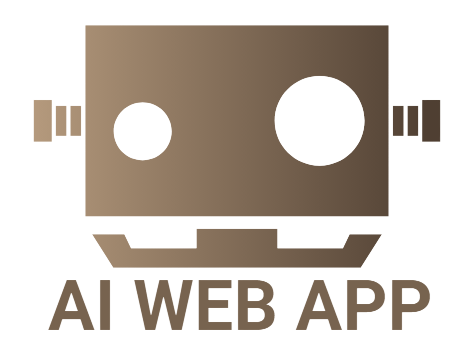

[![Forks][forks-shield]][forks-url]
[![Stargazers][stars-shield]][stars-url]
[![Issues][issues-shield]][issues-url]
[![MIT License][license-shield]][license-url]

<!-- PROJECT LOGO -->
 

  

<h3 align="center">AI Web Application</h3>

  

    Interact with AI by sending messages and receive AI-generated responses.
     
    <a href="https://dchan04aiapp.onrender.com">View Demo</a>
  

<!-- TABLE OF CONTENTS -->

  
Table of Contents

  <ol>
    <li><a href="#about-the-project">About The Project</a></li>
    <li><a href="#screenshots">Screenshots</a></li>
    <li><a href="#technologies">Technologies</a></li>
    <li><a href="#roadmap">Roadmap</a></li>
    <li><a href="#contact">Contact</a></li>
    <li><a href="#license">License</a></li>
  </ol>

<!-- ABOUT THE PROJECT -->

## About the Project

This project explores the capabilities of AI's
potential in Web applications. By simply sending a
message, you'll experience the power of intelligent
AI-generated responses tailored to your input.

## Screenshots

### ChatGPT Page

[![Home page][homepage]](https://dchan04.github.io/OpenAI_Project/)

### AI Moderation Page

[![Table][table]](https://dchan04.github.io/OpenAI_Projecttats)

<!-- Built with  -->

## Technologies

-   [![React][React.js]][React-url]
-   [![Bootstrap][Bootstrap.com]][Bootstrap-url]
-   [![JQuery][JQuery.com]][JQuery-url]
-   ![.Net][ASP.Net]
-   ![NodeJS][Node.js]

(<a href="#readme-top">back to top</a>)

<!-- ROADMAP -->

## Roadmap

I have no plans on working more on this project. Instead, I am looking for ways to incorporate Ai into my future projects.

See the [open issues](https://github.com/dchan04/OpenAI_Project/issues) for a full list of proposed features (and known issues).

(<a href="#readme-top">back to top</a>)

<!-- CONTACT -->

## Contact

Darren Chan - darrenchan1123@gmail.com

Project Link: [https://github.com/dchan04/OpenAI_Project](https://github.com/dchan04/OpenAI_Project)

(<a href="#readme-top">back to top</a>)

<!-- LICENSE -->

## License

Distributed under the MIT License. See `LICENSE.txt` for more information.

(<a href="#readme-top">back to top</a>)

<!-- MARKDOWN LINKS & IMAGES -->
<!-- https://www.markdownguide.org/basic-syntax/#reference-style-links -->

[contributors-shield]: https://img.shields.io/github/contributors/dchan04/OpenAI_Project.svg?style=for-the-badge
[contributors-url]: https://github.com/dchan04/OpenAI_Project/graphs/contributors
[forks-shield]: https://img.shields.io/github/forks/dchan04/OpenAI_Project.svg?style=for-the-badge
[forks-url]: https://github.com/dchan04/OpenAI_Project/network/members
[stars-shield]: https://img.shields.io/github/stars/dchan04/OpenAI_Project.svg?style=for-the-badge
[stars-url]: https://github.com/dchan04/OpenAI_Project/stargazers
[issues-shield]: https://img.shields.io/github/issues/dchan04/OpenAI_Project.svg?style=for-the-badge
[issues-url]: https://github.com/dchan04/OpenAI_Project/issues
[license-shield]: https://img.shields.io/github/license/dchan04/OpenAI_Project.svg?style=for-the-badge
[license-url]: https://github.com/dchan04/OpenAI_Project/blob/master/LICENSE.txt
[linkedin-shield]: https://img.shields.io/badge/-LinkedIn-black.svg?style=for-the-badge&logo=linkedin&colorB=555
[linkedin-url]: https://linkedin.com/in/linkedin_username
[homepage]: images/screenshot1.PNG
[table]: images/screenshot2.PNG
[nested-table]: images/screenshot3.PNG
[Next.js]: https://img.shields.io/badge/next.js-000000?style=for-the-badge&logo=nextdotjs&logoColor=white
[Next-url]: https://nextjs.org/
[React.js]: https://img.shields.io/badge/React-20232A?style=for-the-badge&logo=react&logoColor=61DAFB
[React-url]: https://reactjs.org/
[Vue.js]: https://img.shields.io/badge/Vue.js-35495E?style=for-the-badge&logo=vuedotjs&logoColor=4FC08D
[Vue-url]: https://vuejs.org/
[Angular.io]: https://img.shields.io/badge/Angular-DD0031?style=for-the-badge&logo=angular&logoColor=white
[Angular-url]: https://angular.io/
[Svelte.dev]: https://img.shields.io/badge/Svelte-4A4A55?style=for-the-badge&logo=svelte&logoColor=FF3E00
[Svelte-url]: https://svelte.dev/
[Laravel.com]: https://img.shields.io/badge/Laravel-FF2D20?style=for-the-badge&logo=laravel&logoColor=white
[Laravel-url]: https://laravel.com
[Bootstrap.com]: https://img.shields.io/badge/Bootstrap-563D7C?style=for-the-badge&logo=bootstrap&logoColor=white
[Bootstrap-url]: https://getbootstrap.com
[JQuery.com]: https://img.shields.io/badge/jQuery-0769AD?style=for-the-badge&logo=jquery&logoColor=white
[JQuery-url]: https://jquery.com
[SQLite.com]: https://img.shields.io/badge/sqlite-%2307405e.svg?style=for-the-badge&logo=sqlite&logoColor=white
[SQLite-url]: https://www.sqlite.org/index.html
[ASP.Net]: https://img.shields.io/badge/.NET-5C2D91?style=for-the-badge&logo=.net&logoColor=white
[Node.js]: https://img.shields.io/badge/node.js-6DA55F?style=for-the-badge&logo=node.js&logoColor=white
